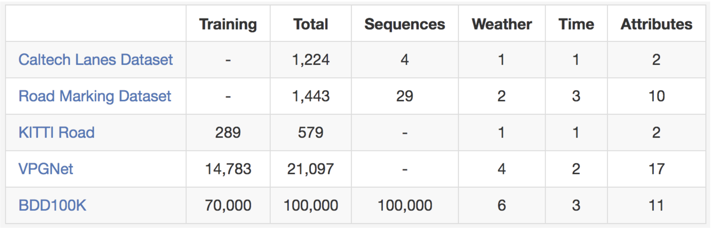

## Problems Apollo Baidu has solved using AI
#### 1. Lidar Point Cloud Obstacle Detection & Classification
* Input - Lidar data
* Annotation type - 3D bbox
* Labels - pedestrians, vehicles, non-motor vehicles (cyclists) and others (dontCares)
* The Laser scanner used for the data acquisition is Velodyne HDL-64E S3
* More details - http://data.apollo.auto/help?name=data_intro_3d&data_key=lidar_obstacle_label&data_type=0&locale=en-us&lang=en

#### 2. Traffic Lights Detection
* Input - 1080P colorized images
* Annotation type - 2D bbox
* Annotations include: locations of traffic lights, colors of lights (red, yellow, green, black), shapes of lights (round, arrow, etc.), types of lights (horizontal, vertical, square, etc.) and other information
* Two cameras for the data collection of traffic lights are mounted on the car roof, one of which uses a lens with a focal length of 25mm and the other uses a lens with a focal length of 6mm 
* More details - http://data.apollo.auto/help?name=data_intro_2d&data_key=traffic_light_label&data_type=0&locale=en-us&lang=en

#### 3. Road Hackers
* Dataset provides two types of data including images in front of vehicles and the vehicle motion status
* The vehicle motion status data include the current speed and the track curvature
* The data of Road Hackers come from the original data of the sensor, including images, laser radars, radars, etc., which are mainly input in the form of images
* It outputs the vehicle’s control instructions, such as the steering wheel angle, acceleration, and braking
* The input and output are connected through the deep neural network, that is, to directly generate the vehicle control instructions through the neural network to carry out the horizontal control and vertical control of the vehicle
* Horizontal control : steering wheel angle
* Vertical control : acceleration and braking
* The platform mainly uses the horizontal control model. It trains the steering wheel control model through the images in front of the vehicle collected by the map collection cars
*  The output here does not use the steering wheel angle. It uses the curvature to be driven (ie, the reciprocal of the turning radius). The reasons are as follows:
1 The curvature is more universally applicable, which is not affected by the vehicle’s own parameters such as steering ratio, wheel base and so on.
2 The relationship between the curvature and the steering wheel angle is simple, which can be retrieved through the Ackermann model at a low speed and be fitted through a simple network at a high speed.
* More details - http://data.apollo.auto/help?name=data_intro_roadhacker&data_key=road_hackers&data_type=0&locale=en-us&lang=en

#### 4. Obstacle Detection[ Image based ]
* Input - 1080P colorized images
* Annotation type - 2D bbox
* Labels - vehicles, pedestrians, cyclists, tricycle and other unmovable obstacles on the road
* Two cameras for the data collection of obstacles are mounted on the car roof, one of which uses a lens with a focal length of 6mm and the other uses a lens with a focal length of 12mm
* More details - http://data.apollo.auto/help?name=data-2d-obstacle-intro&data_key=2d_obstacle_label&data_type=0&locale=en-us&lang=en

#### 5. Obstacle Trajectory Prediction
* The dataset is sampled from the real road scene, and consists of the real motor vehicle obstacles on the road
* It contains the historical data of the vehicle multi-frame information, and obstacle features and lane features generated by a series of perception processing
* Labelling is as follows

| Label|Introduction|
| :---: | :---: |
| -1 | The vehicle is not within the specific lane and will not cut in there in 1 second |
| 0 | The vehicle is within the specific lane but it will not keep this lane in 1 second |
| 1 | The vehicle is within the specific lane and it will keep this lane in 1 second |
| 2 | The vehicle is not within the specific lane but will cut in there in 1 second |
+ Sensors Integration: It includes Lidar (Velodyne HDL-64E S3), two cameras (one uses a 25mm focal length lens and the other uses a 6mm focal length lens), high definition map and localization system
* More details - http://data.apollo.auto/help?name=data_intro_pnc&data_key=prediction_label&data_type=0&locale=en-us&lang=en

#### 6. Scene Parsing Dataset
*  The whole dataset will include RGB videos with ten thousands of high resolution images and per pixel annotation, survey-grade dense 3D points with semantic segmentation, stereoscopic video, and panoramic images
*  Sensors and Data Acquisition: 
-- mid-size SUV with RIEGL VMX-1HA mobile mapping system
-- two LiDAR sensors (500 scan line per second, range 420m, field of view 360 degrees)
-- INS/GNSS unit
-- two front cameras (VMX-CS6, 3384 x 2710). (Images are captured every one meter)

|Group| Class|  Label ID| Color (RGB)|  Description|
| :---: | :---: | :---: | :---: | :---: |
|Sky| Sky|  17| (70,130,180)| -
|Movable object|  Car|  33| (0, 0,142)| -
|-  |Motorcycle|  34  |(0, 0,230)|  Parked without rider
|-  |Bicycle| 35| (119, 11, 32)|  Parked without rider
|-  |Pedestrian|  36| (220, 20, 60)|  -
|-  |Rider| 37| (255, 0, 0)|  Including bicycle, motorcycle, etc.
|-  |Truck| 38| (0, 0, 70)| -
|-| Bus|  39| (0, 60,100)|  -
|-| Pedicab|  40| (0, 0, 90)| -
|Flat|  Road| 49| (128, 64,128)|  -
|-| Sidewalk| 50| (244, 35,232)|  -
|Barrier| Traffic Cone| 65| (152,251,152)|  -
|-| Road Piles| 66| (180,165,180)|  -
|-| Fence|  67| (190,153,153)|  Fence including any holes
|Static Object| Traffic Light|  81| (250,170, 30)|  -
|-| Pole| 82| (153,153,153)|  both horizontal and vertical
|-| Traffic Sign| 83| (220,220, 0)| -
|-| Wall| 84| (102,102,156)|  The wall near the roadside
|-| Trash Can|  85| (0, 0,110)| Not included in evaluation
|-| Billboard|  86| (0, 80,100)|  Not included in evaluation
|Construction|  Building| 97| (70, 70, 70)| -
|-| Bridge| 98| (150,100,100)|  Not included in evaluation
|-| Tunnel| 99| (150,120, 90)|  Not included in evaluation
|-| Overpass| 100|  (250,170,160)|  -
|Nature|  Vegetation| 113|  (107,142, 35)|  -
|Others|  Others| 0|  (0,0, 0)| Not included in evaluation

## Road Profile DNN Hunt
### Road profiles - 
* road polygons
* sidewalks
* lane marking
    * Broken White Line
    * Continuous White Line
    * Continuous Yellow Line
    * Double Continuous Yellow Line
    * Broken Yellow Line
* lanes
  * Ego lanes and other road lanes
  
* road edges

## Road profile architectures -

|Sno| Application Area| Year| DNNArch|  Paper|  Reference|  Github| Remarks|  Annotation Type|  Annotation Tool|
| :---: | :---: | :---: | :---: | :---: | :---: | :---: | :---: | :---: | :---: |
|1|Lane detection|15th-Feb-2018|NA|Towards End-to-End Lane Detection: an Instance Segmentation Approach|https://arxiv.org/abs/1802.05591|https://github.com/MaybeShewill-CV/lanenet-lane-detection|Keras/Tensorflow|polylines for lane markings|NA|
|2|Lane detection||GCN|End to End Video Segmentation for Driving : Lane Detection For Autonomous Car|NA|https://github.com/wenhuizhang/autoCar|Raspberry Pi|NA|NA|
|3|Lane and Road Marking Detection and Recognition|17th-Oct-2017|VPGNet|VPGNet: Vanishing Point Guided Network for Lane and Road Marking Detection and Recognition|https://arxiv.org/abs/1710.06288|https://github.com/SeokjuLee/VPGNet|Caffe|NA|NA|
|4|Lane detection|17th-Dec-2017|"spatial CNN(SCNN)"|Spatial As Deep: Spatial CNN for Traffic Scene Understanding|https://arxiv.org/abs/1712.06080|https://github.com/XingangPan/SCNN|Caffe|NA|NA|
|5|Lane detection||SCNN+Lanenet|Agnostic Lane Detection|NA|https://github.com/cardwing/Codes-for-Lane-Detection|"TensorFlow+PyTorchCustom implementation"|NA|NA|
|6|Lane detection|1th-Feb-2019|NA|End-to-end Lane Detection through Differentiable Least-Squares Fitting|https://arxiv.org/abs/1902.00293v1|https://github.com/wvangansbeke/LaneDetection_End2End|Pytorch|NA|NA|
|7|3D lane detection|27th-Nov_2018|NA|3D-LaneNet: end-to-end 3D multiple lane detection|https://www.researchgate.net/publication/329206980_3D-LaneNet_end-to-end_3D_multiple_lane_detection|NA|From images|NA|NA|
|8|||ReNet|||||||
|9|||MRFNet|||||||

## Road profile datasets -

|Slno|Name|Dataset reference|Paper|Dataset size|Total images|Annotation type|Example|
| :---: | :---: | :---: | :---: | :---: | :---: | :---: | :---: |
|1|TuSimple|https://github.com/TuSimple/tusimple-benchmark/blob/master/doc/lane_detection/readme.md||10000 one-second-long video clips of 20 frames each|200000|Polylines||
|2|CULane|https://xingangpan.github.io/projects/CULane.html||88880 for training set 9675 for validation set 34680 for test set|133235|||
|3|Caltech lanes|http://www.mohamedaly.info/datasets/caltech-lanes||cordova1 with 250 frames cordova2 with 406 frames washington1 with 337 frames washington2 with 232 frames|1225|||
|4|BDD100K|https://bdd-data.berkeley.edu/|https://arxiv.org/abs/1805.04687||100000||
|5|Carla Simulator|||||||
|6|KITTI|||||||
|7|CityPerson|||||||
|8|Cityscapes|||||||
|9|ApolloScape|||Not available in existing open dataset May be in future work||||
|10|Mapillary|||18000 training 2000 validation 5000 test|25000|||
|11|Road Marking Dataset |||||||
|12|KITTI Road |||||||
|13|VPGNet ||||||||




#### Road profile DNN hunt and experimentation to extract road profiles (line geometry like lanes, road edges etc.) which has the geometric sense (x,y,z,y,p,r w.r.t. camera position as 0,0,0)
**- as measured by:**
- Total number of DNNArch referred - not less than 5
- Total number of DNNArch deployed locally and experimented with ob gaze dataset - not less than 2
- Clarity and depth of documentation on the learning of the research - excel sheet, docs, workflow diagrams in internal git-rep
	+ Documentation, experiment results on the understanding and providing insights on differences in the architectural differences this class of DNNArch w.r.t. object detection/segmentation DNNArch (in particular mask_rcnn). For example, reasoning on:
    
	i) Why lanet is better than mask_rcnn for lane segmentation?
	
    ii) Can lanet be used in place of mask_rcnn for object segmentation for object segmentation?

### * SCNN Notes
* CNNs are great for extracting semantics from raw pixels but perform poorly on capturing the spatial relationships (e.g. rotational and translational relationships) of pixels in a frame. These spatial relationships, however, are important for the task of lane detection, where there are strong shape priors but weak appearance coherences.
* For example, it is hard to determine traffic poles solely by extracting semantic features as they lack distinct and coherent appearance cues and are often occluded.
*  Spatial CNN (SCNN) proposes an architecture which “generalizes traditional deep layer-by-layer convolutions to slice-by slice convolutions within feature maps”.
*  In a traditional layer-by-layer CNN, each convolution layer receives input from its preceding layer, applies convolutions and nonlinear activation, and sends the output to the succeeding layer.
*  SCNN takes this a step further by treating individual feature map rows and columns as the “layers”, applying the same process sequentially (where sequentially means that a slice passes information to the succeeding slice only after it has received information from the preceding slices), allowing message passing of pixel information between neurons within the same layer, effectively increasing emphasis on spatial information.

### * Diff b/w cnn, scnn and lanenet

|CNN|SCNN|Lanenet|
| :---: | :---: | :---: |
|CNNs are great for extracting semantics from raw pixels but perform poorly on capturing the spatial relationships (e.g. rotational and translational relationships) of pixels in a frame. These spatial relationships, however, are important for the task of lane detection, where there are strong shape priors but weak appearance coherences.|Spatial CNN (SCNN) proposes an architecture which “generalizes traditional deep layer-by-layer convolutions to slice-by slice convolutions within feature maps”.| Lanenet outputs pixel per frame. To fit a curve through these pixels to get the lane parametrization. The lane pixels are first projected into a ”bird’s-eye view” representation, using a fixed transformation matrix|
|For example, it is hard to determine traffic poles solely by extracting semantic features as they lack distinct and coherent appearance cues and are often occluded.| SCNN takes this a step further by treating individual feature map rows and columns as the “layers”, applying the same process sequentially (where sequentially means that a slice passes information to the succeeding slice only after it has received information from the preceding slices), allowing message passing of pixel information between neurons within the same layer, effectively increasing emphasis on spatial information.|Due to the fact that the transformation parameters are fixed for all images, this raises issues when non flat ground-planes are encountered, e.g. in slopes. To alleviate this problem, we train a network, referred to as H-Net, that estimates the parameters of an ”ideal” perspective transformation, conditioned on the input image.|
||Gets curve line from probability map from matlab|Most popular detect-and-segment approaches (e.g. [14] Mask R-CNN, [38] J. Dai, K. He, and J. Sun. Instance-aware semantic segmentation via multi-task network cascades. In CVPR, 2016) are not ideal for lane instance segmentation, since bounding box detection is more suited for compact objects, which lanes are not.|

#### * H-Net Notes
* The output of LaneNet is a collection of pixels per lane
* Fitting a polynomial through these pixels in the original image space is not ideal, as one has to resort to higher order polynomials to be able to cope with curved lanes.
*  A frequently used solution to this problem is to project the image into a ”bird’s-eye view” representation, in which lanes are parallel to each other and as such, curved lanes can be fitted with a 2nd to 3rd order polynomial.
*  However, in these cases the transformation matrix H is calculated once, and kept fixed for all images. Typically, this leads to errors under ground-plane changes where the vanishing-point, which is projected onto infinity, shifts up or downwards.
*  To resolve this issue we train a neural network, H-Net, with a custom loss function: the network is optimized end-toend to predict the parameters of a perspective transformation H, in which the transformed lane points can be optimally fitted with a 2nd or 3rd order polynomial. The prediction is conditioned on the input image, allowing the network to adapt the projection parameters under ground-plane changes, so that the lane fitting will still be correct. 
*  In our case, **H has 6 degrees of freedom**:
    ```
    H =  a b c
        0 d e
        0 f 1 ]
    ```
The zeros are placed to enforce the constraint that horizontal lines remain horizontal under the transformation.

## Public Datasets for Lane Detection -
##### Purpose is to answer the following questions
* What?
  * What are the different labels for annotations?
  * What geomtries are used for annotations?
  * What are the different annotation tools that can be used for annotation of the road lanes?
  * What are the different evaluation metrics for lane detection?
* How?
  * How the annotations are stored?
  * How the lane detection accuracy is evaluated?

**l. CULane** 
* Culane is a lane dataset for academic research related to traffic lane detection. 
* This dataset contains the data of different drivers of **Beijing**. 
* There are **6 different cameras** are mounted on the vehicles. 
* They have collected more than **55 hours** of videos which have **133,235 frames**. 
* The dataset is divided as training set and validation set. 
* **Training** set has **88880 frames** and the **validation** set or test set has **9675** frames. 
* Further the test set is divided into normal and **8 challenging** categories. 
* For every frame traffic lanes are interpreted with **cubic splines**. 
* If the lanes are occluded by the vehicles or not visible that lanes are also interpreted as per context
* Types of scene in CUlane dataset

|Type of scene|Percentage of data in dataset|
| :---: | :---: |
|Normal|27.7%|
|Crowded|23.4%|
|Night|20.3%|
|No line|11.7%|
|Shadow|2.7%|
|Arrow|2.6%|
|Dazzle light|1.4%|
|Curve|1.2%|
|Crossroad|9.0%|

**Edits-**
https://github.com/XingangPan/SCNN/issues/16

1. Each xxxxx.line.txt is the annotation file for the image xxxxx.jpg. In the annotation file, each line gives the x,y coordinates for key points of a lane marking.
2. The images in laneseg_label_w16 are all black because the pixel values are around 0-4, (0 for background, 1-4 for four lane markings.) So it looks black in 0-255 images.
3. We care about 4 lane markings: 2 on the left and 2 on the right.
  * `1 1 1 0` means you have 2 lane markings on the left, one lane marking on the right.
  * `0 1 1 1` means you have 1 lane marking on the left, two lane markings on the right.

**ll. Caltech**
* The Caltech Lanes dataset has four clips
* The clips are taken on the roads of Pasadena, California. 
* The clips are taken at different day times. 
* There are total 1225 individual frames which are taken from the camera mounted on the Alice.
* Dataset contains the labeled lanes.
* The dataset is divided into 4 clips as shown below

|Name of the Clip|Frames in the Clip|
| :---: | :---: |
|cordova1|250|
|cordova2|406|
|washington1|337|
|washington2|232|
* Clips are gathered from various types of urban streets.
* Dataset contains the streets with shadows and without shadows and straight and curved paths. Straight and curved streets.
* The 1224 visible lanes are hand-labeled in the all 4 clips.
* There are total 4172 marked lanes.
* Clip cordoval1 there are 919 marked lanes, curvatures and writing on the few roads.
* Clip cordova2 has 1048 marked lanes, various pavements and the sun facing the vehicle.
* Clip Washington1 has 1274 marked lanes, lots of shadows on the road and passing vehicles.
* Clip Washington 2 has 931 marked lanes, passing vehicles and street writing.

**lll. NEXET**
* NEXET is the largest and diverse automotive street dataset released by Nexar.
* The data in the dataset is collect by using the Nexar app.
* From total 77 countries the data is collected.
* There are total 50,000 labeled and tagged frames in training dataset and 41190 images in testing dataset.
* Data is collected for various day and night time.
* The dataset aggregate the images and videos taken at different weather conditions, lighting conditions, and geographical locations.
* The researchers have labeled the rear part of nearby cars which could become caught up in a crash.
* https://github.com/ternaus/nexar/tree/master/src


**lV. DIML**
* The images are captured using the OV10630 image sensor.
* There are 470 video sequences in dataset and the image size is 1280 × 800.
* The roads the dataset covered are highway, tunnel, route and urban.
* The scenes are captured in day, night, sunrise and sunset time.
* The weather conditions covered in dataset are rainy, cloudy and clear.
* Additionally, the dataset also covers the conditions like car lamps, lens flare, white lamp, street lamp, yellow lamp.
* The dataset also includes different scenarios like pedestrians, traffic jam and obstacles.
* Categories of DIML dataset

|Category|Scenario covered|Conditions covered|
| :---: | :---: | :---: |
|DIML-LD-1|highway scenario|1. Capture time- Sunset, sunrise, day, night<br>2. Weather conditions-cloudy, rainy, clear.<br>3. Other conditions-car lamps, street lamps, lens flare.|
|DIML-LD-2|Route scenario|1. capture time- Sunset, sunrise, day, night<br>2. Weather conditions cloudy, rainy, clear.<br>3. Other conditions-car lamps, street lamps, lens flare.|
|DIML-LD-3|Urban road|1. capture time- Sunset, sunrise, day, night<br>2. Weather conditions cloudy, rainy, clear.<br>3. Other conditions-car lamps, street lamps, lens flare.|
|DIML-LD-4|Tunnel|Other conditions- yellow lamp, white lamp.|

**V. KITTI Vision Benchmark Suite**
* The KITTI dataset uses two 2 high resolution grayscale andcolor video cameras.
* For accurate ground truth a Velodyne laser scanner and a GPS localization system is used.
* The dataset collected the data by driving on the mid city of Karlsruhe and, urban road and rural roads.
* There are up to 30 pedestrians and 15 cars are visible per image.
* The recording platform of the lane dataset is Volkswagen Passat B6.
* The actuators are for the pedals and the steering wheels.
* The data is recorded using an eight core i7 computer set with a RAID system, running Ubuntu Linux and a real-time database.
* The captured camera images are cropped to size 1382 x 512 pixels.

**Vl. TuSimple Benchmark**
* The Tusimple dataset has divided the road into 2 main groups called static objects and dynamic objects.
* On the highway the lane marking is the main static component. Lane markings guide the vehicle to drive on the highway interactively and safely.
* The dataset contains 7000 video clips of one second. 
* Each video clip contains 20 frames.
* The last frame of each video is labeled.
* Polyline annotation is used for lane marking.
* The data is collected in medium and good weather condition and at different day time.
* It covers 2, 3 and 4 lanes on the highway as well as various traffic conditions.
* The training set contains 3626 videos and 3626 annotated frames. The testing set
includes 2782 video clips
**Edits -**
* https://github.com/TuSimple/tusimple-benchmark/tree/master/doc/lane_detection/assets/examples
* https://github.com/TuSimple/tusimple-benchmark/blob/master/example/lane_demo.ipynb
* https://github.com/TuSimple/tusimple-benchmark/blob/master/doc/lane_detection/readme.md


**Vll. The UAH Driveset**
* The UAH driverset dataset is captured by using the DriveSafe a driving monitoring app. * * Data is recoded in different environment. The application was run on 3 different behaviors (aggressive, normal and drowsy) and six various drivers and vehicles on 2 types of streets (secondary road and motor way).
* The dataset contains 500 minutes driving raw data plus some semantic information.
* The drive safe app monitors and alerts you while driving.
* It also detects the roughness in your vehicle's motion, processes the location in lane and the lane changes, the maximum permitted speed and number of lanes of the street , and detects the in front vehicles and the distance/time kept to them and many more things.

**Vlll. BDD100K**
* BDD100K is the largest and diverse dataset released by TLDR.
* This dataset is rich with annotations. With the help of Nexar the BDD100K database is released.
* The BDD100K dataset contains 100,000. Each video is of 40 second long with 30 frames per second. 
* Videos are captured from the diverse locations in US.
* The videos come with GPS/IMU information recorded by cell-phones to demonstrate uneven driving trajectories.
* Dataset covers the different weather conditions like rainy, sunny, overcast and different times of day such as daytime and nighttime.
* A keyframe at the tenth second from every video is sampled and annotation is given to that keyframes.
* These are labeled at various levels like road object bounding boxes, image tagging, lane markings, full-frame instance segmentation and drivable areas.

**lX. KAIST**
* http://irap.kaist.ac.kr/dataset/
* https://sites.google.com/site/ykchoicv/multispectral_ijrr
* https://github.com/irapkaist/data_viewer
* https://github.com/POSTECH-IMLAB/LaneSegmentationNetwork

**X. Apolloscape**
* http://apolloscape.auto/lane_segmentation.html
* https://github.com/ApolloScapeAuto/dataset-api
* https://github.com/ApolloScapeAuto/dataset-api/blob/master/lane_segmentation/LanemarkDiscription.pdf

||CULane|Caltech|NEXET|DIML|KITTI|TuSimple|UAH|BDD100K|Cityscape|Apolloscape|Mapillary Vistas|
| :---: | :---: | :---: | :---: | :---: | :---: | :---: | :---: | :---: | :---: | :---: | :---: |
|Sequences|More than 55 hrs of videos|4 clips|NA|470|22|700|500 min video|100000|7 months|4|NA|
|Images|133235|1225|50000|-|14999|140000|NA|120000000|5k fine annotated and 20k weakly annotated images|147k|25k|
|Classes|||||34|||19|34|36|66|
|Multiple citis|NO|NO|Yes 77 cities|YES|NO|YES|YES|YES|Yes 50 cities|NO|YES|
|Multiple weathers|NO|YES|YES|YES|NO|NO|YES|YES|YES|NO|YES|
|Multiple times of day|YES|YES|YES|YES|NO|NO|YES|YES|YES|NO|YES|
|Multiple scene type|YES|YES|YES|YES|YES|YES|YES|YES|YES|NO|YES|
|Multiple cameras|YES|NO|YES|YES|YES|NO|NO|YES|YES|YES|YES|
|Multiple street type|NO|NO|YES|YES|YES|NO|YES|YES|YES|YES|YES|
|Streets labeled|NO|YES|YES|YES|NO|YES|YES|YES|YES|YES|YES|

## Add-ons
* semantic segmentation of lane marks
https://www.visteon.com/wp-content/uploads/2019/02/reliable-multilane-detection-and-classi%EF%AC%81cation-by-utilizing-cnn-as-a-regression-network-2.pdf
* MIoU (mean intersection over union) metric
* Classified left_side, left_ego, right_ego and right_side lane types are represented by green, orange, red and blue colors
* Apolloscape Evaluation - conventional Intersection-over-Union scores, also known as the **Jaccard Index**

## References

* http://apollo.auto/developer.html
* http://data.apollo.auto/?locale=en-us&lang=en
* Videos - 
  * http://apollo.auto/devcenter/devcenter.html
* Traffic Light Perception -
  * https://github.com/ApolloAuto/apollo/blob/master/docs/specs/traffic_light.md
* 3D Obstacle Perception - 
  * https://github.com/ApolloAuto/apollo/blob/master/docs/specs/3d_obstacle_perception.md
* Autonomous Vehicle Lab - Chris X Edwards [ Everything but slightly old]
  * http://xed.ch/av/
* TuSimple dataset - 
  * https://github.com/TuSimple/tusimple-benchmark/blob/master/doc/lane_detection/readme.md
* https://www.researchgate.net/publication/329206980_3D-LaneNet_end-to-end_3D_multiple_lane_detection/download
* http://www.cvlibs.net/datasets/kitti/eval_road.php
* Leaderboard - https://paperswithcode.com/task/lane-detection
* https://github.com/open-mmlab/mmdetection


